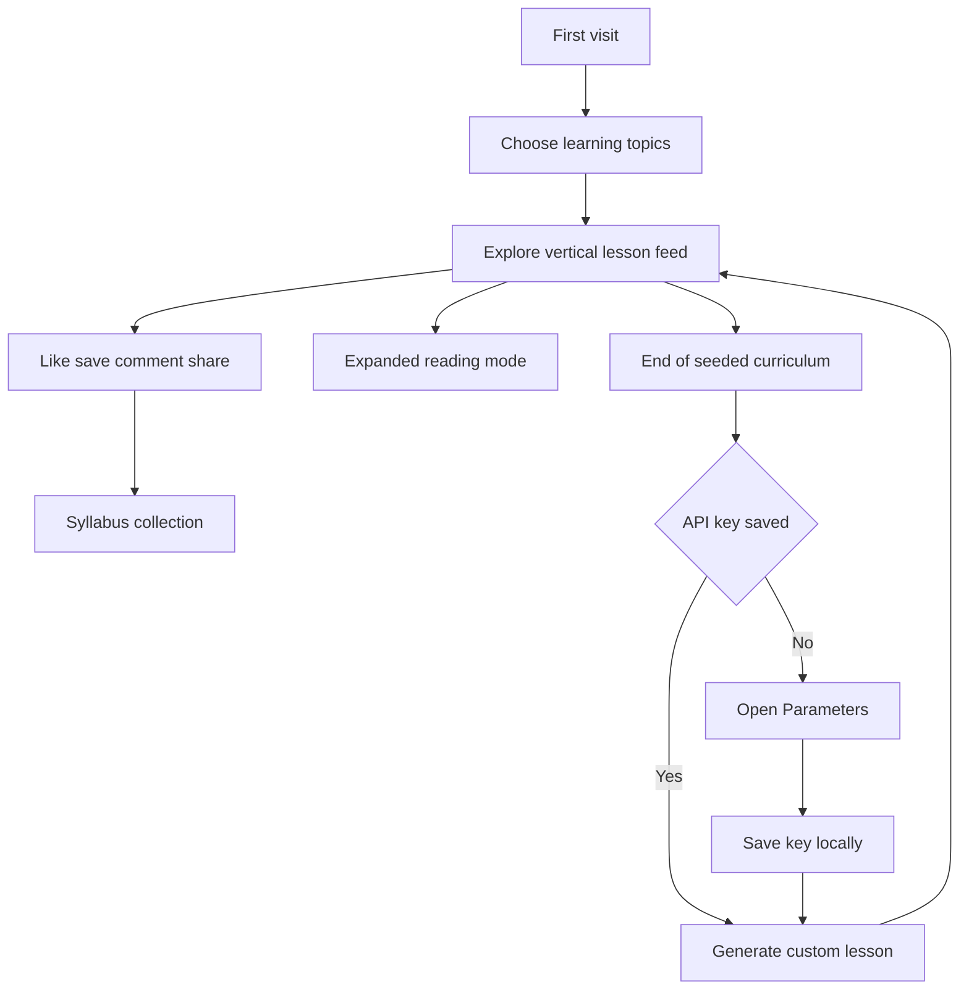

# LearnScroll

> A mobile-first learning feed that turns short-form scrolling into a curated microlearning experience.

LearnScroll is a TikTok-inspired educational web app for discovering bite-sized lessons, saving knowledge cards into a personal syllabus, and generating new learning slides with a bring-your-own API key workflow.

It is designed as a portfolio product concept: familiar social-feed interaction patterns are repurposed for focused learning, reflective reading, and lightweight knowledge collection.

---

## Product vision

Most short-form feeds are optimized for passive entertainment. LearnScroll explores the opposite idea: what if a vertical feed could feel just as fluid, but every card taught something useful?

The app combines:

- **A vertical snap-scroll feed** for quick discovery.
- **Curated educational cards** across books, science, history, philosophy, language, focus, and life skills.
- **A personal syllabus collection** for bookmarked lessons.
- **Local-first persistence** for likes, comments, bookmarks, completed cards, selected topics, and API key settings.
- **Optional AI generation** for creating fresh personalized lesson cards from the user’s selected interests.

---

## Screenshots

Add screenshots or product mockups here when available.

| Explore feed | Expanded lesson | Syllabus collection |
| --- | --- | --- |
|  |  |  |

| Onboarding | Parameters | Discussion drawer |
| --- | --- | --- |
|  |  |  |

---

## User experience

### 1. Curate your syllabus

On first launch, users choose learning topics such as:

- Book summaries
- Recent world news
- Trivia & fun facts
- Study & focus tips
- Music recommendations
- Science & nature facts
- History highlights
- Philosophy & quotes
- Language learning snippets
- Life skills & how-to tips

Those selected interests become the filter for the main learning feed.

### 2. Scroll through learning cards

The Explore tab presents a full-screen vertical feed. Each card includes:

- A short title
- Category label
- Creator-style channel name
- Concise explanatory paragraphs
- A highlighted takeaway
- Hashtags
- Like, bookmark, comment, share, and subscribe actions

Cards can be tapped to open a more spacious reading mode with the takeaway pinned at the bottom.

### 3. Save cards into a syllabus

Bookmarked cards appear in the Syllabus tab, where users can revisit saved lessons, expand summaries, remove bookmarks, or jump back to the original card in the feed.

### 4. Reflect through comments

Each card has a discussion drawer where users can add local comments. This creates a lightweight reflection layer without requiring accounts or backend infrastructure.

### 5. Generate new lessons

After saving an OpenRouter-compatible API key in Parameters, users can generate new custom learning cards. Generated cards are added to the local feed and persisted in browser storage.

---

## Feature highlights

- **Mobile-first interface** with a centered app shell and vertical snap scrolling.
- **Onboarding flow** that filters the learning feed by selected interests.
- **Pre-seeded curriculum** with educational starter cards.
- **Expanded reading overlay** for deeper reading without losing scroll position.
- **Like, bookmark, subscribe, share, and comment interactions.**
- **Syllabus collection** for saved knowledge cards.
- **Settings dashboard** with progress stats, active topic controls, API key management, and reset controls.
- **Local persistence** using browser `localStorage`.
- **BYOK AI generation** through a chat-completions endpoint.
- **No backend required** for the core experience.

---

## Tech stack

- **React 19** for the UI.
- **TypeScript** for typed data models and component props.
- **Vite** for local development and builds.
- **Tailwind CSS** for utility-first styling.
- **Motion** for animations and transitions.
- **Lucide React** for icons.
- **Browser localStorage** for persistence.

---

## How the app works



---

## Project structure

```text
LearnScroll/
├── assets/
│   └── .aistudio/
├── src/
│   ├── components/
│   │   ├── BookmarkView.tsx
│   │   ├── CommentDrawer.tsx
│   │   ├── ContentCard.tsx
│   │   ├── Onboarding.tsx
│   │   └── Settings.tsx
│   ├── data/
│   │   └── defaultCards.ts
│   ├── App.tsx
│   ├── index.css
│   ├── main.tsx
│   └── types.ts
├── index.html
├── package.json
├── tsconfig.json
└── vite.config.ts
```

### Key files

- `src/App.tsx` owns app state, persistence, navigation, feed filtering, comments, bookmarks, and AI card generation.
- `src/components/Onboarding.tsx` lets users select interests before entering the main app.
- `src/components/ContentCard.tsx` renders the full-screen feed cards and expanded reading overlay.
- `src/components/BookmarkView.tsx` displays the saved syllabus collection.
- `src/components/Settings.tsx` manages topic preferences, stats, API key storage, and reset actions.
- `src/components/CommentDrawer.tsx` provides the slide-up discussion UI.
- `src/data/defaultCards.ts` contains the pre-seeded educational curriculum.
- `src/types.ts` defines the shared `Category`, `Card`, `Comment`, and `UserProfile` types.

---

## Local setup

### Prerequisites

- Node.js
- npm

### Install dependencies

```bash
npm install
```

### Start the development server

```bash
npm run dev
```

The app runs with Vite on port `3000` and is configured to listen on `0.0.0.0`.

### Build for production

```bash
npm run build
```

### Preview the production build

```bash
npm run preview
```

### Type-check the project

```bash
npm run lint
```

---

## Available scripts

| Script | Description |
| --- | --- |
| `npm run dev` | Starts the Vite development server. |
| `npm run build` | Builds the production bundle. |
| `npm run preview` | Serves the production build locally. |
| `npm run lint` | Runs TypeScript checking with no emitted files. |
| `npm run clean` | Removes generated `dist` and `server.js` files. |

---

## Data and persistence

LearnScroll is local-first. The app stores user state in browser `localStorage` under these keys:

| Storage key | Purpose |
| --- | --- |
| `learnscroll_profile` | Username, email, selected interests, subscribed channels, and saved API key. |
| `learnscroll_custom_cards` | AI-generated cards added after the seeded curriculum. |
| `learnscroll_comments` | User-created comments. |
| `learnscroll_likes` | IDs of liked cards. |
| `learnscroll_bookmarks` | IDs of bookmarked cards. |
| `learnscroll_completed_reads` | IDs of cards marked as completed after viewing. |

The Settings screen includes a reset option that clears all local app state.

---

## AI generation notes

The app supports optional custom card generation using a bring-your-own-key workflow.

Current behavior:

- The user enters an API key in Parameters.
- The key is stored only in browser `localStorage`.
- The Explore end slide can generate a new lesson card.
- The generation request asks for strict JSON matching the app’s `Card` model.
- The generated card is appended to the feed and persisted locally.

The UI labels this as an OpenRouter BYOK flow. The request is made from the browser, so production hardening should consider provider compatibility, key handling, rate limits, and whether requests should be proxied through a backend.

---

## Design direction

LearnScroll uses a restrained academic visual style rather than a noisy social-media aesthetic:

- Warm paper-like background tones.
- Dark text and high-contrast content cards.
- Serif body copy for lesson readability.
- Lightweight borders and subtle shadows.
- Compact action controls inspired by short-form media apps.
- Motion transitions for tab changes, overlays, drawers, and micro-interactions.

---

## Future improvements

- Add real screenshot assets to `assets/screenshots/`.
- Add tests for card filtering, persistence, and interaction handlers.
- Add accessibility refinements for keyboard navigation and screen reader labels.
- Add richer progress analytics and learning streaks.
- Add import/export for local learning data.
- Move AI requests behind a backend proxy for stronger production security.
- Add deployment instructions for a chosen hosting provider.

---

## Project summary

LearnScroll is a React and TypeScript portfolio app that reimagines the addictive mechanics of short-form scrolling as a focused learning product. It demonstrates product thinking, interaction design, local-first state management, typed component architecture, and optional AI-assisted content generation in a polished mobile-first interface.
